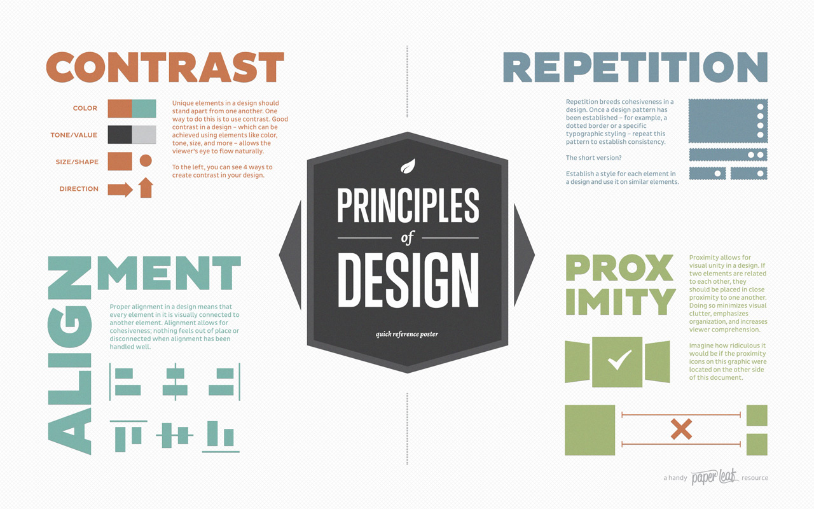

# Welcome to Week 2 of WRTG 393!

This week, complete the following tasks:

- Examine an article by Matt Eland about personas. [Personas_in_Writing.pdf](WEEK2\Week2_LearningResource_Personas_in_Writing.pdf)

- Read through several learning resources on how to write instructions. [Learning Resources](#learning-resources)

- Watch a video tutorial on tips for writing instructions for a website.

- Watch some video tutorials on Proximity, Alignment, Repetition, and Contrast (PARC).

## Discussion Topics

You will respond to two discussion topics:

1. **Discussion 1** The first discussion topic asks you to complete various exercises designed to help you become familiar with UMGC’s library OneSearch interface. Discussion 1 tasks [link](#Discussion2-OneSearch)

2. **Discussion 2** The second discussion topic asks you to examine a website for  [PARC](#Discussion2-PARC) principles. Then examine the website for the James Bond 007 museum: http://www.007museum.com/ .  In your response, discuss how the website does or does not follow the principles of PARC.

## Writing Assignment

- You will also submit Writing Assignment #1, which involves creating three personas.

## [Learning Resources](#learning-resources)

<!-- link to Week2 Learning Resource -->
[Personas_in_Writing.pdf](WEEK2\Week2_LearningResource_Personas_in_Writing.pdf)

Additional Resources on Writing Instructions
[Resources on Writing Instructions](https://leocontent.umgc.edu/content/umuc/tus/wrtg/wrtg393/2228/modules/resources-on-writing-instructions.html)

The following resources provide excellent tips in writing instructions:

[Technical Writing Essentials: Writing Instructions](https://pressbooks.bccampus.ca/technicalwriting/chapter/writinginstructions/)

[Wikibooks: Professional and Technical Writing--Instructions](https://en.wikibooks.org/wiki/Professional_and_Technical_Writing/Instructions)

[Jerz's Literacy Weblog: How to Write Guides for Busy Grouches](https://jerz.setonhill.edu/writing/technical-writing/instructions-how-to-write-for-busy-grouchy-people/)

[Writing Commons: Creating Rhetorically Effective Instruction Manuals](https://writingcommons.org/article/creating-rhetorically-effective-instruction-manuals/)

[Technical Writing for Business People](../Technical_Writing_for_Business.pdf)

[Video Tutorial: Tips on Writing Instructions for a Website](https://app.screencast.com/qJUoIjhZjAdfI)

## [Discussion2 OneSearch](#Discussion2-OneSearch)

Please watch the following video tutorials:

[library tutorial #1](https://umgc-edu.zoom.us/rec/play/YgXrnz1KmwwUn27EtakakWhwJ0YlzPHej-dufns1MpyQwNLO0z2NAcoOEMNRK2hFfsF7qbHgCyD9qWV2.ADGt8U4rk6oo0SYs?canPlayFromShare=true&from=share_recording_detail&continueMode=true&componentName=rec-play&originRequestUrl=https%3A%2F%2Fumgc-edu.zoom.us%2Frec%2Fshare%2FkcZ9WhjMOE3aDldWeLcrMJB_lmjJB7WdDiQVOS3AKATvduBXowXLna6iP6q2YpOO.jAHTpjgNQYnCB2-o)

[library tutorial #2](https://umgc-edu.zoom.us/rec/play/fqyXzdfmj7Rbcae26qWygC7EqkSs8MpxM7IBz17B-jWE3dnSCu-afWXCEPrsD2xHa33gwjSUINRtcmls.P6D0zuERmUJ6ifTa?canPlayFromShare=true&from=share_recording_detail&continueMode=true&componentName=rec-play&originRequestUrl=https%3A%2F%2Fumgc-edu.zoom.us%2Frec%2Fshare%2FyRsI4NZ3njUmb1KN1rCqNY4T2f-NiQS00N0NzgUsbYbxy5l9vkb3AKslm3Lu3mlV.vu5euYmbaZnJTlqZ)
 
[library tutorial #3 ](https://umgc-edu.zoom.us/rec/play/GsaoDzTHeNOXf5Ow-PGx6I0a6wfJD7AS-vTl7nVv-r4Haews5KzyN0AJELzvE6_OS_7mz2UUfVB7ttq9.YzVA-rUkHMz03olH?canPlayFromShare=true&from=share_recording_detail&continueMode=true&componentName=rec-play&originRequestUrl=https%3A%2F%2Fumgc-edu.zoom.us%2Frec%2Fshare%2FtPgrB4dmlwuYLJInK9CYaIGp9jEebRgbscKAU2eW7B5giSv-DcxQZGQPOtcF5jOk.GNpq31DlY1iX8Iej)

[library tutorial #4 on the use of the asterisk](https://app.screencast.com/x5kfKDSb5jwRe)

After you have watched the tutorials, please complete the following tasks. Post your responses to this discussion thread.

*Let us assume you work for a financial services company that is considering using ChatGPT to write email communication with its customers.*

*Your supervisor has asked you to conduct research on the use of ChatGPT in the workplace in general and on its use for customer correspondence.*

*The instructions you have been given by your supervisor are quite broad. But let us assume that this is the directive you have been given.*

*For this reason, you will conduct a very general search on the use of ChatGPT in the workplace. You are not quite sure how to focus the topic, but you know that you would like to pursue this general topic and focus it later.*

Using the strategies discussed in library video tutorial 

1. search on some terms and find four articles on this topic. Your search can be quite broad at this stage. Try to use some search phrases that require that you use quotation marks, as the video demonstrates. Please write the topic on which you searched and the search terms you used to search on it. In addition, please write titles of the four articles and the journals in which they appeared. You don't have to cite anything in APA format, or anything of that nature. Just post the titles and the journal names.
2. Then, applying the tips in library video tutorial 
#2, focus your search from question #2 by using the SU-subject terms option from the drop-down menu for one of the rows. -How many search results do you find after limiting the search by using SU-subject terms?
3. Using the strategies discussed in library video tutorial #2, conduct a new search on a phrase related to your major or to a workplace topic of interest to you. As the video demonstrates, make sure to use quotation marks around the phrase you search on.
-What phrase(s) did you search on?
-How many search results do you get?
4. Using the strategies discussed in library video tutorial on the use of the asterisk, conduct the same search, but this time use one of your terms and place an asterisk next to a form of the term in order to search on all forms of that term.
-What term did you search on with the asterisk?
-How many search results do you get?
5. Finally, using the strategies mentioned in library video tutorial #3, locate the subject guide (formerly called the research guide) for your major. If you have not declared a major yet, please select one that interests you. Peruse the research guide for that major. Describe to the rest of the class in a few sentences any interesting resources you discovered.

If you have the same major as another student in the class, this would be a great time to collaborate and share any resources you found with which others might not be familiar.

## [Discussion2 PARC](#Discussion2-PARC)

- Proximity, Alignment, Repetition, and Contrast (PARC) are four principles of design that you will use in writing assignment #2.

    

- **Promixity**: Items that are related to each other should be grouped together. When several items are in close proximity to each other, they become one visual unit rather than several separate units. Elements that are related logically should be close together physically. [video link](https://www.screencast.com/t/E9SAXwJh3rEw)

- **Alignment**: Nothing should be placed on the page arbitrarily. Every item should have a visual connection with something else on the page. Aligning elements allows them to create a visual connection with each other or a heireirchal organization to various grouped elements . Alignment consists of both visible and invisible lines that connect different objects. Nothing on a well-designed page should look randomly placed. [video link](https://www.screencast.com/t/QKt7FIc7fl)

- **Repetition**: Repetition strengthens the unity of a design by tying together otherwise separate parts. Repetition can be achieved through repeating some aspect of an element such as a color, shape, texture, spatial relationship, or line thickness. [video link](https://www.screencast.com/t/6Z2Z2Z2Z)

- **Contrast**: Contrast is the juxtaposition of opposing elements (opposite colors on the color wheel, or value light / dark, or direction - horizontal / vertical). Contrast allows you to emphasize or highlight key elements in your design. [video link](https://www.screencast.com/t/6Z2Z2Z2Z)

